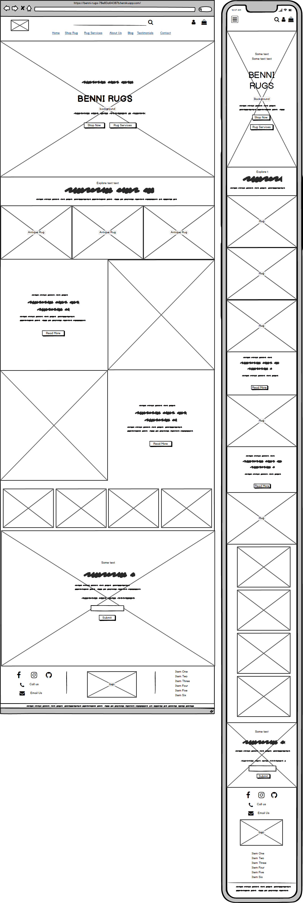
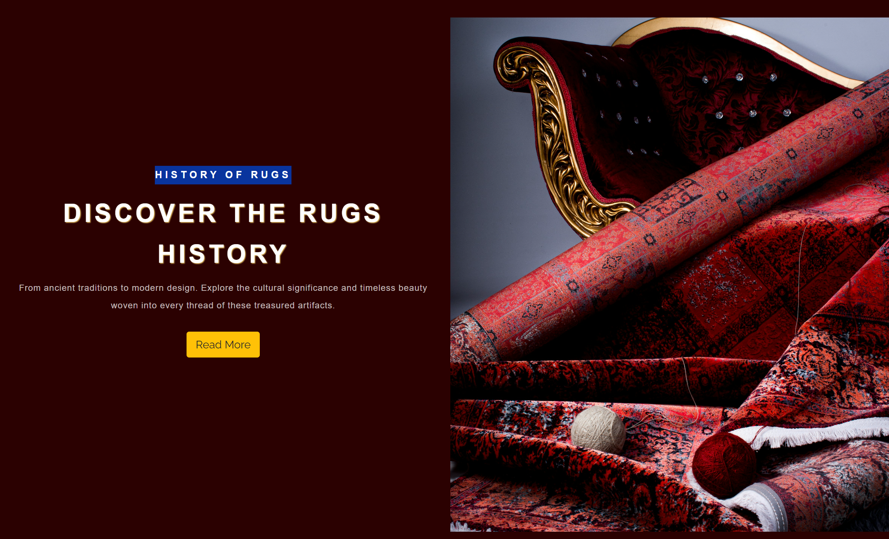
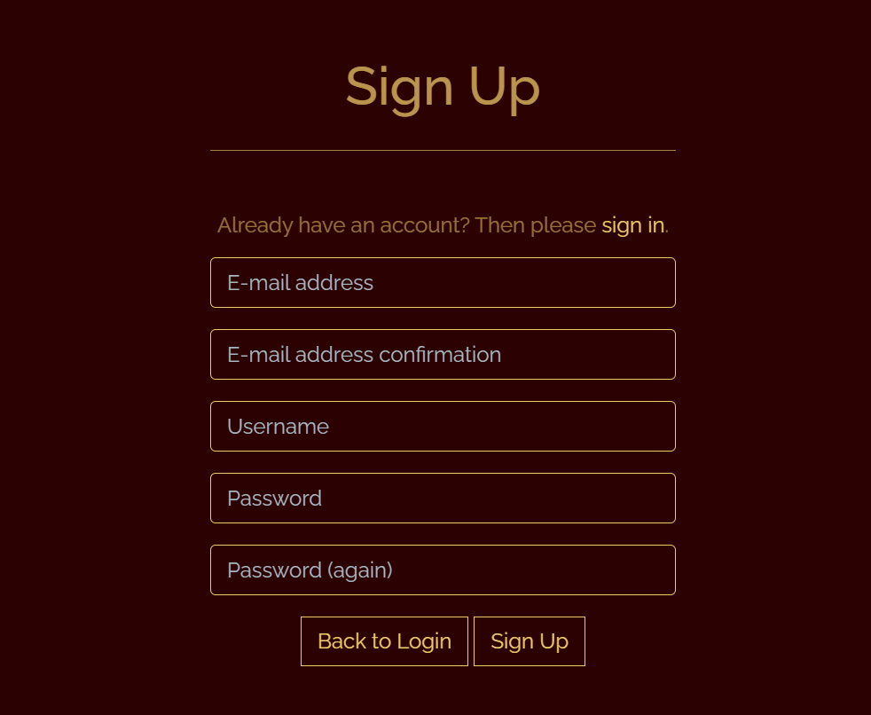

# Benni Rugs

Benni Rugs is an e-commerce store specializing in Persian rugs and rug services. The site targets users interested in antique and historical products, as well as high-end services like rug washing and repair.

Users can browse and purchase a variety of rug products or explore the different types of rug services offered and make an inquiry. They can also read testimonials from other users or leave their own. Additionally, the blog provides information about rugs and related services.

The payment system uses Stripe. Please note that this website is for educational purposes only. Do not enter any personal credit/debit card details when using the site.

To test this system, test card details can be used. A list of these can be found in Stripe's documentation [here](https://stripe.com/docs/testing#cards).

The live link can be found here - [Benni Rugs](https://benni-rugs-78e83a64387b.herokuapp.com/)


- [User Experience (UX)](#user-experience--ux-)
  * [User Stories](#user-stories)
  * [Design](#design)
    + [Colour Scheme](#colour-scheme)
    + [Imagery](#imagery)
    + [Fonts](#fonts)
    + [Wireframes](#wireframes)
- [Database Schema](#database-schema)
- [Security Features and Defensive Design](#security-features-and-defensive-design)
  * [User Authentication](#user-authentication)
  * [Form Validation](#form-validation)
  * [Database Security](#database-security)
  * [Custom error pages:](#custom-error-pages-)
- [Features](#features)
  * [Header](#header)
  * [Footer](#footer)
  * [Home Page](#home-page)
  * [User Account Pages](#user-account-pages)
  * [Profile](#profile)
  * [Shop Rugs (Products)](#shop-rugs--products-)
  * [Product Detail](#product-detail)
  * [Shop Rugs Management](#shop-rugs-management)
  * [Bag](#bag)
  * [Checkout](#checkout)
  * [Rugs Services](#rugs-services)
  * [Rug Services Management](#rug-services-management)
  * [About Us](#about-us)
  * [Blog](#blog)
  * [Testimonials](#testimonials)
  * [Contact Form](#contact-form)
  * [Enquiries Dashboard](#enquiries-dashboard)
  * [Error Pages](#error-pages)
- [Business Model](#business-model)
- [Marketing Strategy](#marketing-strategy)
  * [SEO](#seo)
  * [Social Media Marketing](#social-media-marketing)
  * [Email Marketing](#email-marketing)
- [Deployment - Heroku](#deployment---heroku)
  * [Create the Heroku App](#create-the-heroku-app)
  * [Attach the Postgres Database](#attach-the-postgres-database)
  * [Update Heroku Config Vars](#update-heroku-config-vars)
  * [Deploy](#deploy)
- [AWS Set Up](#aws-set-up)
  * [AWS S3 Bucket](#aws-s3-bucket)
  * [IAM](#iam)
  * [Connecting S3 to Django](#connecting-s3-to-django)
- [Forking this repository](#forking-this-repository)
- [Cloning this repository](#cloning-this-repository)
- [Languages](#languages)
- [Frameworks - Libraries - Programs Used](#frameworks---libraries---programs-used)
- [Credits](#credits)
- [Acknowledgments](#acknowledgments)

<small><i><a href='http://ecotrust-canada.github.io/markdown-toc/'>Table of contents generated with markdown-toc</a></i></small>

## User Experience (UX)

A visitor to Benni Rugs would be someone who is most likely an adult who is interested in buying Antique or modern rug products and high-end rug services.

### User Stories

#### EPIC | Viewing and Navigation
- As a Site User, I can intuitively navigate around the site so that I can find content.
- As a Site User, I can view a list of products so that I can select a product to view.
- As a shopper, I can click on a product so that I can read the full product details.
- As a shopper, I can view a specific category of products so I can browse the type of products I'm looking for.
- As a shopper, I can search all products so that I can find what I am looking for.
- As a shopper, I can sort all products so that I can view products based on price or title.
- As a site user, I can view a list of rug Services provided so I can understand what each service entails and make an enquiry if desired.
- As a site user, I can read information about the history of rugs, rug weaving, and how rugs are repaired and washed.
- As a site user, I can read information about Benni Rugs E-commerce shop and their performance
- As a site user, I can read testimonials left by other customers so I see what feedback they gave on the rug products or services they received.
- As a site user, I can register my Email address to be subscribed and receive the company news.

#### EPIC | User Account and Profile
- As a site user, I can register an account so that I can have a personal account.
- As a site user, I can log in or log out of my account so that I can keep my account secure.
- As a site user, I can see my login status so that I know if I'm logged in or out.
- As a site user, I can save my personal details in my user profile so that I do not have to fill them out for future orders.
- As a site user, I can view my order history so that I can remember what purchases I've made.
- As a site user, I can recover my password in case I forget it so that I can recover access to my account.

#### EPIC | Purchasing
- As a shopper, I can add a number of products in different quantities to my shopping bag so that I can purchase them all together when I am ready.
- As a shopper, I can view a running total of my shopping bag as I am shopping so that I can see how much it costs in total.
- As a shopper, I can view the contents of my shopping bag at any time so I can see what is included and the total cost.
- As a shopper, I can adjust the quantity of individual products in my bag so that I can easily make changes before I purchase.
- As a shopper, I can see a summary of my shopping cart when I checkout so that I know what products are included and the total cost before I commit to purchasing.
- As a shopper, I can easily enter my payment information securely so that I can purchase my chosen products quickly with no issues.
- As a shopper checkout as a guest so I don't have to sign up for an account.
- As a shopper, I can view an order confirmation after checkout so that I know my purchase was successful.
- As a shopper, I can receive an email confirmation of my order so that I have a record of my purchase.


#### EPIC | Admin & Store Management
- As a store owner, I can add/edit/delete products through an easy-to-use interface so that I can manage the store's contents.
- As a site owner, I can add/edit/delete rug services provided through an easy-to-use interface so that I can manage the site's contents.
- As a site owner, I can view and delete customer enquiries on the front-end without having to access the admin panel.

#### EPIC | User Interaction
- As a site user, I can submit an enquiry form about the issue I need to be contacted.
- As a site user, I can add / edit / delete my testimonial in relation to a consultation I received so that I can give my feedback.
- As a site user, I can sign up for the website's newsletter so that I can keep up to date with new products and promotions.

#### User stories not yet implemented

The following user stories were scoped out of the project due to time constraints and labelled as "Won't Have" on the project board on Github. It is intended that these user stories will be implemented at a later date.

- As a shopper, I can add products to my saved items so that I can go back and view them at a later date.
- As a shopper, I can view my saved products so I can find them easily in the one location.
- As a shopper, I can check the average rating of each product based on previous customer submissions.

### Design

The site features an elegant and dark design, accented with gold details to evoke a sense of luxury and antiquity. 

#### Colour Scheme
Colour palette from Coolors


The color scheme of the site is primarily gold and Sangria. The Sangria color is inspired by the hues of antique Persian rugs, while the gold color for text and details adds an elegant contrast to the site.

#### Imagery
The main page's first images are inspired by a traditional rug shop, showcasing basic weaving devices and various types of Persian rugs. Additionally, there are three images highlighting the main types of rugs available on the site. Following these, two images transport users to the history of rugs and rug weaving. Another four images displays room designed with different type of rugs, and at the end, a modern symbolic image illustrates the comfort and versatility of rugs for any space.

#### Fonts
The Lexend Deca and Raleway fonts are the main fonts used for the title and body of the website. These font was imported via Google Fonts. Sans Serif is the backup font, in case for any reason the main font isn't being imported into the site correctly.

#### Wireframes

<details>

 <summary>Home Page</summary>


</details>

<details>

 <summary>Shop Rugs Page</summary>


</details>

<details>

 <summary>Rug Services Page</summary>


</details>

<details>

 <summary>About-us, and Blog Pages</summary>


</details>

<details>

 <summary>Testimonials Page</summary>


</details>

<details>

 <summary>Contact Page</summary>


</details>

<details>

 <summary>Bag Page</summary>


</details>

<details>

 <summary>Checkout Page</summary>


</details>

<details>

 <summary>Order Confirmation Page</summary>


</details>

<details>

 <summary>Enquiries Page</summary>


</details>

<details>

 <summary>Profile Page</summary>


</details>

<details>

 <summary>Product Management Page</summary>


</details>

<details>

 <summary>Rug Service Management Page</summary>


</details>

## Database Schema 

Two relational databases were used to create this site - during production SQLite was used and then Postgres was used for the deployed Heroku version. Below is an image of how the database models relate to each other:


## Security Features and Defensive Design
### User Authentication

Where I have used Django's Class-based-views; Django's LoginRequiredMixin is used to make sure that any requests to access secure pages by non-authenticated users are redirected to the login page. Django's UserPassesTestMixin is used to limit access based on certain permissions i.e. to ensure users can only edit/delete Testimonials for which they are the author or if the user is the superuser. If the user doesn't pass the test they are shown an HTTP 403 Forbidden error.

Where I have used function based views I have used Django's login_required and user_passes_test decorators to restrict access as required. 

### Form Validation
If incorrect or empty data is added to a form, the form won't submit and a warning will appear to the user informing them what field raised the error.

### Database Security
The database url and secret key are stored in the env.py file to prevent unwanted connections to the database. Stripe keys and wh secret are also stored in the env.py file. 

Cross-Site Request Forgery (CSRF) tokens were used on all forms throughout this site.

### Custom error pages:
Custom Error Pages were created to give the user more information on the error and to provide them with buttons to guide them back to the site.

400 Bad Request - Benni Rugs is unable to handle this request.
403 Page Forbidden - Looks like you're trying to access forbidden content. Please log out and sign in to the correct account.
404 Page Not Found - The page you're looking for doesn't exist.
500 Server Error - Due to an internal error we are unable to process this request.

## Features

### Header


**Logo**
- I designed the website's logo inspired by the traditional rug shape and the name of the website, using the main colors featured on the site.
- This logo is positioned in the top left of the navigation bar and the middle part of the footer. The logo is linked to the home page for ease of navigation for the user.


**Navigation Bar**

- The navigation bar is visible at the top of every page and includes links to the other pages.

**Search Bar**


- The search bar displays above the nav bar.
- On smaller screens, this bar becomes a search icon which when clicked will drop down the full bar.
- Any searched word will match itself to any text in the product's title, or description and display the results on the product's page.


**User Icon**


- The User icon navigation link is a drop down menu which includes the Sign up and Log in links. 
- Once a user has signed in, their username will display beside the user icon.
- The options to Sign up or Log in will change to the option to log out once a user has logged in.
- Once a user has signed in, the 'My Profile' option becomes available in the User dropdown.


- If the superuser has signed in, more options such as 'Shop Rug Management', 'Rug Service Management', and 'Enquiries' become available in the User dropdown.


- The navigation bar is fully responsive, collapsing into a hamburger menu when the screen size becomes too small.
- Hovering over the links will turn the font gold.

**Bag Icon**


- Located on the right side of the navbar next to the User icon is the bag Icon.
- Once a product is added to the bag, a number displaying the total quantity of items appears, located at the top right of the bag icon.
- As the user adds products to their bag, a toast message appears in the top right-hand corner of the screen informing the user that the item has been added, giving them a snapshot of the bag contents and the total cost of the bag.


- Clicking the bag icon navigates the user to the shopping bag page which displays a summary of what's been added.

### Footer


- The footer appears at the bottom of every page.
- The left/top section of the footer includes links to Facebook, Instagram and Github and contact links for call and email.
- There is a newsletter signup section powered by Mailchimp where the user can input their email address to signup to the monthly newsletter.
- The Quick Links section has links to the main parts of the site including 'Contact Us' and 'Privacy Policy'.
- On the right hand side of the footer there are links high quality relevant websites including Houzz, Institute of Designers Ireland, and The Interiors Association. These links were included to increase the search rating of the website.
- Clicking all external links will open up the respective website in another tab to avoid pulling the user away from the site.

### Home Page

**Call to Action Section**


- The home page includes the name of shop 'Benni Rugs' and a call to action section which encourages the user to 'shop now' or to browse "our services" with the message "WELCOME TO OUR GALLERY" and an image of historical rug shop. 

**Explore Our Collection**


- The "Explore Our Collection" section features a small gallery where each photo represents a specific rug type and redirects users to the product page for the selected rug type.

**History of Rugs**



- The "History of Rugs" section includes an image of a traditional rug, along with a title and description about the rug's history. There is also a button that directs the user to the history blog page.

**Rug Weaving**


- The "Rug Weaving" section includes an image of a woman weaving a rug, along with a title and description about rug weaving. There is also a button that directs the user to the Rug Weaving blog page.

**Keep In Touch**


- The "Keep in Touch" section features a background image of a woman's feet on a rug, illustrating the comfort of the rugs. This section includes a title and description about subscribing and staying in touch. There is also an input field with a submit button that posts the user's subscription request to the server.

### User Account Pages

**Sign Up**



**Sign In**


**Log Out**


**Password Reset**


- Django allauth was installed and used to create the Sign up, Log in and Log out functionality. 
- Success messages inform the user if they have logged in/ logged out successfully.
- When a user signs up for an account they must verify their email address by clicking on the authentication link emailed to the address they provided.
- If a user forgets their password they can reset it by clicking the 'Forgot Password' on the log in page.


### Profile


**Delivery Details**
- The delivery details section stores the user's delivery address and phone number.
- The information provided here is used to autofill the delivery address when placing an order.

**Order History**
- The order history section displays a list of every order the user has placed.
- The table displays the order number, date it was ordered and the order total.
- Clicking the order number will take the user to a summary page of that order.

### Shop Rugs (Products)


- When clicking the 'Shop Rugs' link in the navbar the dropdown menu will show all the different categories including 'Antique Rugs', 'Modern Rugs', 'Kilim', 'Runner Rugs' and 'Wall Art Rugs'. 


- The 'All Rugs' link will display a list of all products from the database.
- Clicking any of the categories will filter the products to only show products from the category selected.
- The category selected will display as the page heading.


- Each product card shows an image of the product, its title, excerpt and price.
- If the user is a superuser, edit and delete buttons will appear at the bottom of the product card.
- The products page is fully responsive, adjusting how many products are on each row depending on the user's screen size.
- A sort box is located on the products page where users can sort all products by price in ascending or descending order and by title (A-Z).


### Product Detail


- When the user clicks on an individual product card they are taken to the full product details. The link is a bootstrap stretched link so clicking anywhere on the card will work.
- The product detail page displays the product image, title, excerpt, price, dimension, product details and estimated dispatch time.
- If the user is a superuser, edit and delete buttons will appear below these details.

**Quantity Buttons**
- The quantity buttons are located underneath the product details and are used to add items to the bag.
- The plus and minus buttons increase and decrease the input value.
- If the value is set to 1 the minus quantity will be disabled. Respectively if the value is set to 99 the plus button is disabled.
- If the user manually types in a negative number or a number >99 and clicks "Add to Bag" an error button will appear informing the user of the parameters needed to be successful.
- Clicking the 'Add to Bag' button takes the number in the input field and adds that amount of products to the bag.
- Clicking the 'Keep Shopping' button takes the user back to the store.

### Shop Rugs Management
**Add Product**


- The add product page can be accessed by clicking the 'Add Product' button on the Shop Rugs page or in the user dropdown menu, Benni Rugs Management. These options are only visible to superusers.
- If a user tries to add a product (by changing the url) without being a superuser they are redirected to a custom 403 page.
- The user must fill out all the fields that have an Asterix. If the form is submitted with any of these fields left blank or with just whitespace then an error message will appear above that particular field, notifying the user of the issue.
- The SKU field must be unique. An error message will appear if the SKU already exists.
- If a price is added with more than 6 digits the form will fail and an error message will appear under the price field.
- Width and height are additional requirements for filling in the form to provide users with the dimensions of each product.
- The superuser can upload a photo if they wish. If they choose not to, a default image displays as their product image.
- Clicking the 'Add Product' button at the bottom of the form will create the product providing there are no errors on the form.
- The superuser will receive a success message notifying them that the product has been successfully added.

**Edit Product**


- The superuser can choose to edit a Product by clicking the edit button on the product card or on the product detail page. 
- The form opens with all fields populated with the original content.
- The image field displays a thumbnail of the existing image and has a checkbox option to remove it. Checking this will change the image to the default image.
- If a user tries to add a product (by changing the url) without being a superuser they are redirected to a custom 403 page.
- The superuser will receive a success message notifying them that the product has been successfully updated.

**Delete Product**


- The superuser can choose to delete a Product by clicking the delete button on the product card or on the product detail page. 
- The superuser is asked to confirm if they wish to delete the product or cancel.
- The superuser will receive a success message notifying them that the product has been successfully deleted.

### Bag


- When the user clicks on the shopping bag icon in the nav bar they are taken to the shopping bag page which shows the products which the user has added to their cart, unit price, quantity and subtotal.

**Quantity Buttons**
- The quantity input box displays the product quantity the user has added to their bag.
- The plus and minus buttons increase and decrease the input value.
- If the value is set to 1 the minus quantity will be disabled. Respectively if the value is set to 99 the plus button is disabled.

**Update and Delete Buttons**


- Clicking the 'update' icon button saves any changes to the quantity and updates the item's subtotal.
- Clicking the 'Bin' icon button removes the item completely from the user's bag.
- If the user manually types in a negative number and clicks 'update', the item will be removed from the item from the bag.
- If the user manually types in a number >99 and clicks 'update' an error message will display informing the user of the correct parameters.

**Total Section**
- At the end of the line items is a summary of the costs.
- The summary features the bags total, delivery cost and the grand total to pay.
- Underneath the grand total users will find a message informing them of how much more they need to spend to receive free delivery if they haven't already met the free delivery threshold (£1000). 
- Beneath the grand total is two buttons. From here the user can either continue to the checkout or return to the products page by clicking 'Continue Shopping'.

### Checkout 


**Details**
- Within the details section the user can fill out their contact details, delivery address, and card number.
- If the user is a guest, a link to create an account or login will be present.
- If the user is signed in a checkbox to save the delivery information can be checked.
- If the user is signed in and has delivery information saved, the delivery details and email address will be automatically filled in.
- If a user leaves a required field empty, inputs whitespace in a required field or includes text in the phone number field an error message will prompt the user to 'Fill in the field' or 'match the format requested'

**Order Summary**
- The order summary section details all the items about to be purchased, along with the quantity, subtotal and a grand total.
- Next to the order summary title will be a number reflecting the total number of items that appear in the order.
- Clicking the product image in the summary will take the user to that product's detail page.

**Payment**
- The card payment is handled by Stripe to ensure secure payment.
- Incorrect card numbers will automatically show an invalid card number error.
- A loading screen will appear when a payment is being processed to stop the user clicking away.
- There is a warning message at the bottom of the page informing the user of how much their card is about to be charged.
- If the payment form doesn't submit properly or the user closes the browser during the wait animation, the order will still be created in the database through the webhook. 
- Once the payment is processed, the webhook will search the database to confirm the order exists. If it cannot find it, it will create one using the payment information.

**Loading the Payment Process**

- Once the payment has been submitted the user is shown a loading page for the payment process.

**Confirmation**

- Once the order has been processed the user is taken to the checkout success page.
This page summarises the completed order.
- An email will be sent to the user with their order confirmation
- At the end of the summary is a 'Keep Shopping' button that takes the user back to the Shop Rugs page.

### Rugs Services


- The Rug Services page can be accessed by clicking on the link in the nav bar. 
- When the user navigates to the Rug Services page they are presented with a list of all Rugs Services from the database including image, title and detailed description. 
- An "Enquire Now" button displays beside each service which will take the user to the Contact form when clicked.


- If the user is a superuser, edit and delete buttons will display below each services' details instead of the enquire now button.
- If the user is a superuser, The add service buttom will display to redirect the superuser to the add service page.

### Rug Services Management
**Add Service**

- The add service page can be accessed by clicking the 'Add Service' button on the Rugs Services page or in the user dropdown menu, under Rugs Services Management. These options are only visible to superusers.
- If a user tries to add a service (by changing the url) without being a superuser they are redirected to a custom 403 page.
- The user must fill out all the fields that have an Asterix. If the form is submitted with any of these fields left blank or with just whitespace then an error message will appear above that particular field, notifying the user of the issue.
- The user can upload a photo if they wish. If they choose not to, a default image displays as their service image.
- Clicking the 'Add Service' button at the bottom of the form will create the service providing there are no errors on the form.
-  The user will receive a success message notifying them that the service has been successfully added.

**Edit Service**

- The superuser can choose to edit a Service by clicking the edit button under the service description on the Rugs Services Page. 
- The form opens with all fields populated with the original content.
- The image field displays a thumbnail of the existing image and has a checkbox option to remove it. Checking this will change the image to the default image.
- If a user tries to add a service (by changing the url) without being a superuser they are redirected to a custom 403 page.
- The superuser will receive a success message notifying them that the service has been successfully updated.

**Delete Service**

- The superuser can choose to delete a Service by clicking the delete button under the service description on the Rugs Services Page.
- The superuser is asked to confirm if they wish to delete the service or cancel.
- The superuser will receive a success message notifying them that the service has been successfully deleted.

### About Us

- When the user clicks on the "About Us" tab in the navigation bar, they are taken to a page displaying a blog with information about us.
- This page includes an image and content providing details about the organization.

### Blog

- When clicking the 'Blog' link in the navbar the dropdown menu will show all the different items including 'History of Rug', 'Rug Weaving' and 'Rug Repair'. 

**History of Rug**

- When the user clicks on the "Blog" tab in the navigation bar, the drop-down menu includes a link to "History of Rug" which takes them to a page displaying a blog post on the history of rugs.
- This page includes an image and content about the history of rugs, which helps with the website's SEO.

**Eug Weaving**

- When the user clicks on the "Blog" tab in the navigation bar, the drop-down menu includes a link to "Rug Weaving" which takes them to a page displaying a blog post on the Rug Weaving.
- This page includes an image and content about the Rug Weaving, which helps with the website's SEO.

**Rug Repair**

- When the user clicks on the "Blog" tab in the navigation bar, the drop-down menu includes a link to "Rug Repair" which takes them to a page displaying a blog post on the Rug repair procedures nad methods.
- This page includes an image and content about the Rug Repairs, which helps with the website's SEO.


### Testimonials


- The testimonials page can be accessed by clicking the link in the nav bar.
- When the user navigates to the Testimonials page they can see all testimonials left by previous clients. 
- Each testimonial displays the Rug Service they relate to, the date and the user's name.

**Add Testimonial**

- When a logged-in user clicks on the "Add Testimonial" button on the Testimonials page, they can see a user-friendly form where they can add a new Testimonial to the site.
- If the user is not logged in they are redirected to the log-in page.
- The Add Testimonial page includes a rating option where users can rate the service they received from 1 to 5 stars.
- The completed testimonial is automatically populated with the user's username and date underneath the body.

**Edit Testimonial**

- The user is able to edit their own testimonials by clicking the edit button which display beside their own testimonial on the Testimonials Page.
- The edit form fields are pre-populated with the existing testimonial text.
- If a user tries to update a testimonial (by changing the url) without being signed in they are redirected to the log in page.
- If a user tries to update another user's testimonial (by changing the url) they receive a custom 403 error.
- To respect the users' opinions, The superuser can not edit anyone's testimonial.
- The user will receive a success message notifying them that the testimonial has been successfully updated.

**Delete Testimonial**


- The user can choose to delete their own testimonial by clicking the delete button which display beside their own testimonial on the Testimonials Page.
- The user is asked to confirm if they wish to delete the testimonial or cancel.
- The user will receive a success message notifying them that the testimonial has been successfully deleted.
- If a user tries to delete a testimonial (by changing the url) without being signed in they are redirected to the log in page.
- If a user tries to delete another user's testimonial (by changing the url) they receive a custom 403 error.
- To respect the users' opinions, The superuser can not delete anyone's testimonial.

### Contact Form

- A user can open up the contact form by clicking on the "Enquire Now" button on the Rugs Services page or by clicking the 'Contact' button in the Nav bar.
- If the user is logged in, the email field is prepopulated with the user's email address. 
- The form contains a drop down menu where the user can select the type of enquiry from a list so that the site owner knows what the enquiry is about.
- The user must fill out all the fields that have an Asterix. If the form is submitted with any of these fields left blank or with just whitespace then an error message will appear above that particular field, notifying the user of the issue.
- When the form is submitted, the user receives an email confirmation of their enquiry so that they have a record of it.

### Enquiries Dashboard


- When the site owner is logged in, an Enquiries Management option appears in the User drop-down menu.
- When the site owner navigates to the Enquiries Management page they can see a list of user enquiries sorted from newest to oldest.
- Emails that have been read are greyed out.
- When the site owner clicks on an enquiry they are taken to the individual enquiry detail.


- The site owner can choose to delete the enquiry or to go back to the list of enquiries.

### Error Pages
Custom Error Pages were created to give the user more information on the error and to guide them back to the site.

- 400 Bad Request - Benni Rugs is unable to handle this request.

- 403 Page Forbidden - Looks like you're trying to access forbidden content. Please log out and sign in to the correct account.

- 404 Page Not Found - The page you're looking for doesn't exist.
- 500 Server Error - Due to an internal error we are unable to process this request.

## Business Model

Benni Rugs's Business Model is Business to Consumer (B2C). Products and services are sold directly from Benni Rugs to consumers who are the end-users. 
A customer of Benni Rugs would be someone who is most likely an adult who is interested in buying antiques and modern rugs and high end Rugs services.

## Marketing Strategy

A number of different marketing strategies have been utilised to promote Benni Rugs including SEO, content marketing, social media marketing and email marketing. Each of these strategies have been discussed individually below:  

### SEO
Several SEO techniques were undertaken in order to ensure the site ranks highly in search engine results:

**Keywords:** 

A mixture of short tail and long tail keywords were carefully considered for the site. Keyword research was performed by checking Google search results, looking at competitor's keywords and by utilising wordtracker.com. 

An initial list of topics and keywords generated can be seen below. This list was then refined based on relevance and authority.

The most relevant keywords have been added to the site's meta-keywords and meta-description. These keywords have also been carefully included in page titles, headings, site content, `<strong></strong>` tags, image alt attributes and anchor tag links across the site. 


**Building Trust:**

In order to build brand trust, a testimonial page for Rugs services has been included in the site with a link to the page being included in the page footer as well as the main nav bar. 

The page footer also includes links to the privacy policy to inform users about how their data is being collected and processed.

**Sitemap and robots.txt**

A sitemap file with a list of important page URLs was created to ensure that search engines are able to understand the site's structure and easily navigate through the site. This was made using xml-sitemaps.com.

A robots.txt file was created to tell search engines where they are not allowed to go on the website. This improves SEO by increasing the quality of the site

### Social Media Marketing 
For this site, a Facebook business page can be created for organic social media marketing. The Facebook page can include a 'Shop Now' button which takes the user to the Benni Rugs website. The page can pair well with the content media marketing on the main site as images of new product arrivals can be shared easily.

### Email Marketing
Visitors to the site can sign up to the newsletter and do not need to have an account to do so. A signup box is located at the bottom section of the home page. This allows the business to share news with customers and potential customers including new products/services and special offers.

## Deployment - Heroku

To deploy this page to Heroku from its GitHub repository, the following steps were taken:

### Create the Heroku App:
- Log in to [Heroku](https://dashboard.heroku.com/apps) or create an account.
- On the main page click the button labelled New in the top right corner and from the drop-down menu select "Create New App".
- Enter a unique and meaningful app name.
- Next, select your region.
- Click on the Create App button.

### Attach the Postgres Database:
- In the Resources tab, under add-ons, type in Postgres and select the Heroku Postgres option.
- Copy the DATABASE_URL located in Config Vars in the Settings Tab.
- Go back to your IDE and install 2 more requirements:
    - `pip3 install dj_databse_url`
    - `pip3 install psycopg2-binary` 
- Create requirements.txt file by typing `pip3 freeze --local > requirements.txt`
- Add the DATABASE_URL value and your chosen SECRET_KEY value to the env.py file. 
- In settings.py file import dj_database_url, comment out the default configurations within database settings and add the following: 

```
DATABASES = {
    'default': dj_database_url.parse(os.environ.get('DATABASE_URL'))
}
```
- Run migrations and create a superuser for the new database. 
- Create an if statement in settings.py to run the postgres database when using the app on heroku or sqlite if not

```
    if 'DATABASE_URL' in os.environ:
        DATABASES = {
            'default': dj_database_url.parse(os.environ.get('DATABASE_URL'))
        }
    else:
        DATABASES = {
            'default': {
                'ENGINE': 'django.db.backends.sqlite3',
                'NAME': BASE_DIR / 'db.sqlite3',
            }
    }
```

- Create requirements.txt file by typing `pip3 freeze --local > requirements.txt`
- Create a file named "Procfile" in the main directory and add the following: `web: gunicorn project-name.wsgi:application`
- Add Heroku to the ALLOWED_HOSTS list in settings.py in the format ['app_name.heroku.com', 'localhost']

- Push these changes to Github.

### Update Heroku Config Vars
Add the following Config Vars in Heroku:

|     Variable name     |                           Value/where to find value                           |
|:---------------------:|:-----------------------------------------------------------------------------:|
| AWS_ACCESS_KEY_ID     | AWS CSV file(instructions below)                                               |
| AWS_SECRET_ACCESS_KEY | AWS CSV file(instructions below)                                               |
| DATABASE_URL          | Postgres generated (as per step above)                                        |
| EMAIL_HOST_PASS       | Password from email client                                                    |
| EMAIL_HOST_USER       | Site's email address                                                          |
| SECRET_KEY            | Random key generated as above                                                 |
| STRIPE_PUBLIC_KEY     | Stripe Dashboard > Developers tab > API Keys > Publishable key                |
| STRIPE_SECRET_KEY     | Stripe Dashboard > Developers tab > API Keys > Secret key                     |
| STRIPE_WH_SECRET      | Stripe Dashboard > Developers tab > Webhooks > site endpoint > Signing secret |
| USE_AWS               | True (when AWS set up - instructions below)                                   |

### Deploy
- NB: Ensure in Django settings, DEBUG is False
- Go to the deploy tab on Heroku and connect to GitHub, then to the required repository. 
- Scroll to the bottom of the deploy page and either click Enable Automatic Deploys for automatic deploys or Deploy Branch to deploy manually. Manually deployed branches will need re-deploying each time the repo is updated.
- Click View to view the deployed site.

The site is now live and operational.


## AWS Set Up
### AWS S3 Bucket
- Create an AWS account.
- From the 'Services' tab on the AWS Management Console, search 'S3' and select it.
- Click 'Create a new bucket', give it a name(match your Heroku app name if possible), and choose the region closest to you.
- Under 'Object Ownership' select 'ACLs enabled' and leave the Object Ownership as Bucket owner preferred.
- Uncheck block all public access and acknowledge that the bucket will be public.
- Click 'Create bucket'.
- Open the created bucket, go to the 'Properties' tab. Scroll to the bottom and under 'Static website hosting' click 'edit' and change the Static website hosting option to 'enabled'. Copy the default values for the index and error documents and click 'save changes'.
- Open the 'Permissions' tab, locate the CORS configuration section and add the following code:
```
[
  {
      "AllowedHeaders": [
          "Authorization"
      ],
      "AllowedMethods": [
          "GET"
      ],
      "AllowedOrigins": [
          "*"
      ],
      "ExposeHeaders": []
  }
]
```
- In the 'Bucket Policy' section and select 'Policy Generator'.
- Choose 'S3 Bucket Policy' from the type dropdown.
- In 'Step 2: Add Statements', add the following settings:
    - Effect: Allow
    - Principal: *
    - Actions: GetObject
    - ARN: Bucket ARN (copy from S3 Bucket page)
- Click 'Add Statement'.
- Click 'Generate Policy'.
- Copy the policy from the popup that appears
- Paste the generated policy into the Permissions > Bucket Policy area.
- Add '/*' at the end of the 'Resource' key, and save.
- Go to the 'Access Control List' section click edit and enable List for Everyone (public access) and accept the warning box.


### IAM
- From the 'Services' menu, search IAM and select it.
- Once on the IAM page, click 'User Groups' from the side bar, then click 'Create group'. Choose a name and click 'Create'.
- Go to 'Policies', click 'Create New Policy'. Go to the 'JSON' tab and click 'Import Managed Policy'. 
- Search 'S3' and select 'AmazonS3FullAccess'. Click 'Import'.
- Get the bucket ARN from 'S3 Permissions' as per above.
- Delete the '*' from the 'Resource' key and add the following code into the area:

```
"Resource": [
    "YOUR-ARN-NO-HERE",
    "YOUR-ARN-NO-HERE/*"
]
```

- Click 'Next Tags' > 'Next Review' and then provide a name and description and click 'Create Policy'.
- Click'User Groups' and open the created group. Go to the 'Permissions' tab and click 'Add Permissions' and then 'Attach Policies'.
- Search for the policy you created and click 'Add Permissions'.
- You need to create a user to put in the group. Select users from the sidebar and click 'Add user'.
- Give your user a user name, check 'Programmatic Access'.
- Click 'Next' and select the group you created.
- Keep clicking 'Next' until you reach the 'Create user' button and click that.
- Download the CSV file which contains the AWS_SECRET_ACCESS_KEY and your AWS_ACCESS_KEY_ID needed in the Heroku variables as per above list and also in your env.py.


### Connecting S3 to Django 
- Go back to your IDE and install 2 more requirements:
    - `pip3 install boto3`
    - `pip3 install django-storages` 
- Update your requirements.txt file by typing `pip3 freeze --local > requirements.txt` and add storages to your installed apps.
- Create an if statement in settings.py 

```
if 'USE_AWS' in os.environ:
    AWS_STORAGE_BUCKET_NAME = 'insert-your-bucket-name-here'
    AWS_S3_REGION_NAME = 'insert-your-region-here'
    AWS_ACCESS_KEY_ID = os.environ.get('AWS_ACCESS_KEY_ID')
    AWS_SECRET_ACCESS_KEY = os.environ.get('AWS_SECRET_ACCESS_KEY')

```
- Then add the line 

    - `AWS_S3_CUSTOM_DOMAIN = f'{AWS_STORAGE_BUCKET_NAME}.s3.amazonaws.com'` to tell django where our static files will be coming from in production.


- Create a file called custom storages and import both our settings from django.con as well as the s3boto3 storage class from django storages. 
- Create the following classes:

```
class StaticStorage(S3Boto3Storage):
    location = settings.STATICFILES_LOCATION

class MediaStorage(S3Boto3Storage):
    location = settings.MEDIAFILES_LOCATION
```

- In settings.py add the following inside the if statement:

```
STATICFILES_STORAGE = 'custom_storages.StaticStorage'
STATICFILES_LOCATION = 'static'
DEFAULT_FILE_STORAGE = 'custom_storages.MediaStorage'
MEDIAFILES_LOCATION = 'media'
STATIC_URL = f'https://{AWS_S3_CUSTOM_DOMAIN}/{STATICFILES_LOCATION}/'
MEDIA_URL = f'https://{AWS_S3_CUSTOM_DOMAIN}/{MEDIAFILES_LOCATION}/'

```

- and then add the following at the top of the if statement:
```
AWS_S3_OBJECT_PARAMETERS = {
    'Expires': 'Thu, 31 Dec 2099 20:00:00 GMT',
    'CacheControl': 'max-age=94608000',
}
```

- Go to S3, go to your bucket and click 'Create folder'. Name the folder 'media' and click 'Save'.
- Inside the folder, click 'Upload', 'Add files', and then select all the images that you are using for your site.
- Then under 'Permissions' select the option 'Grant public-read access' and click upload.
- Your static files and media files should be automatically linked from django to your S3 bucket.

## Forking this repository
- Locate the repository at this link [Benni Rugs](https://github.com/BENNI-GITHUB/project-04-Benni-Rugs).
- At the top of the repository, on the right side of the page, select "Fork" from the buttons available. 
- A copy of the repository is now created.

## Cloning this repository
To clone this repository follow the below steps: 

1. Locate the repository at this link [Benni Rugs](https://github.com/BENNI-GITHUB/project-04-Benni-Rugs). 
2. Under **'Code'**, see the different cloning options, HTTPS, SSH, and GitHub CLI. Click the prefered cloning option, and then copy the link provided. 
3. Open **Terminal**.
4. In Terminal, change the current working directory to the desired location of the cloned directory.
5. Type **'git clone'**, and then paste the URL copied from GitHub earlier. 
6. Type **'Enter'** to create the local clone. 

## Languages

- Python
- HTML5
- CSS3
- Javascript

## Frameworks - Libraries - Programs Used
- [Django](https://www.djangoproject.com/): Main python framework used in the development of this project
- [Django-allauth](https://django-allauth.readthedocs.io/en/latest/installation.html): authentication library used to create the user accounts
- [JQuery](https://jquery.com/)
- [PostgreSQL](https://www.postgresql.org/) was used as the database for this project.
- [SQLite](https://www.sqlite.org/index.html) - was used as the database during production.
- [Stripe](https://stripe.com/ie) used for the payments system.
- [AWS](https://aws.amazon.com/?nc2=h_lg) used for file storage.
- [Heroku](https://dashboard.heroku.com/login) - was used as the cloud based platform to deploy the site on.
- [Responsinator](http://www.responsinator.com/) - Used to verify responsiveness of website on different devices.
- [Balsamiq](https://balsamiq.com/) - Used to generate Wireframe images.
- [Chrome Dev Tools](https://developer.chrome.com/docs/devtools/) - Used for overall development and tweaking, including testing responsiveness and performance.
- [Font Awesome](https://fontawesome.com/) - Used for icons in information bar.
- [GitHub](https://github.com/) - Used for version control and agile tool.
- [Google Fonts](https://fonts.google.com/) - Used to import and alter fonts on the page.
- [W3C](https://www.w3.org/) - Used for HTML & CSS Validation.
- [Jshint](https://jshint.com/) - used to validate javascript
- [Coolors](https://coolors.co/) - Used to create colour palette.
- [Favicon](https://favicon.io/) - Used to create the favicon.
- [Lucidchart](https://lucid.app/documents#/dashboard) - used to create the database schema design
- [Grammerly](https://app.grammarly.com/) - used to proof read the README.md
- [Crispy Forms](https://django-crispy-forms.readthedocs.io/en/latest/) used to manage Django Forms
- [Bootstrap 4.6](https://getbootstrap.com/docs/4.6/getting-started/introduction/): CSS Framework for developing responsiveness and styling
- [Photoshop](https://hatchful.shopify.com/): Used to design the logo
- [Tables Generator](https://www.tablesgenerator.com/markdown_tables): Used to convert excel testing tables to markdown
- [Sitemap Generator](www.xml-sitemaps.com): used to create sitemap.xml 
- [Privacy Policy Generator](https://www.privacypolicygenerator.info/): Used to create the site's privacy policy

## Credits

- [W3Schools](https://www.w3schools.com/)
- [Django Docs](https://docs.djangoproject.com/en/4.0/)
- [Bootstrap 4.6 Docs](https://getbootstrap.com/docs/4.6/getting-started/introduction/)
- [Stack Overflow](https://stackoverflow.com/)
- [Freepik](https://www.freepik.com/): Imagery on the site was sourced from freepik
- [Unsplashed](https://unsplash.com/): Imagery on the site was sourced from Unsplash
- [Code Institute - Boutique Ado Walkthrough Project](https://github.com/Code-Institute-Solutions/boutique_ado_v1)
- [Stack Overflow](https://stackoverflow.com): To solve some issues and problem during the project


## Acknowledgments

- Many thanks to my mentor, Mr. Antonio, for his support and advice.
- Many thanks to Code Institute tutoring for their time and guidance in solving my problems during the project.
- Thanks to The Code Institute Slack community for their quick responses and very helpful feedback.